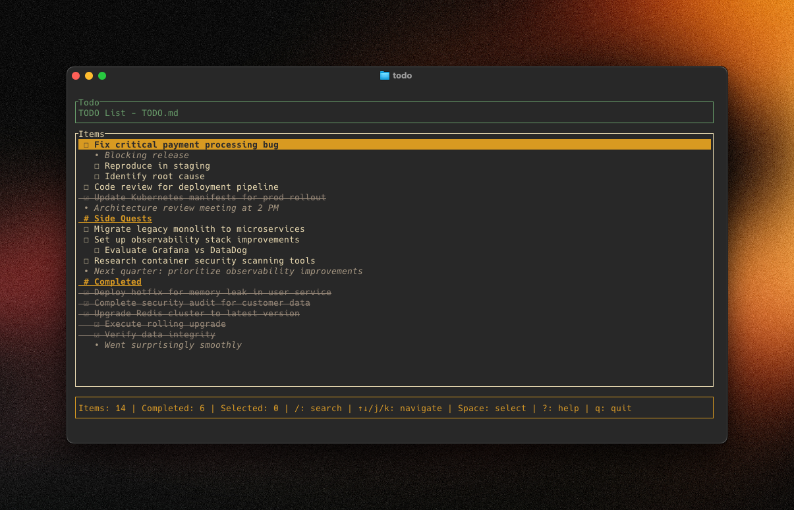

# todo

This is a CLI for my [favored to-do system](https://btao.org/posts/2025-03-15-productivity/), a simple `TODO.md` file.

It's really just for personal use. It might not work for you.



## Setup

### 1. Configure TODO file location

First, tell the app where your TODO.md file is:

```bash
todo config set file_path ~/Documents/TODO.md
```

### 2. Enable shell completion (optional)

To get tab completion for file paths when configuring:

**For zsh (most common on macOS):**
```bash
# Generate completion script
todo completion zsh > ~/.config/todo/completion.zsh

# Add to your ~/.zshrc
echo 'source ~/.config/todo/completion.zsh' >> ~/.zshrc

# Reload shell
source ~/.zshrc
```

**For bash:**
```bash
# Generate completion script  
todo completion bash > ~/.config/todo/completion.bash

# Add to your ~/.bashrc or ~/.bash_profile
echo 'source ~/.config/todo/completion.bash' >> ~/.bashrc
```

## Usage

```bash
# View your TODO list (TUI - coming soon!)
todo

# Configuration commands
todo config set file_path <path>    # Set TODO file location
todo config get file_path           # Show current file path
todo config list                    # Show all configuration
```
